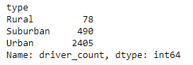
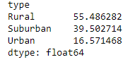

# PyBer_Analysis - Challenge Number 5

## Overview of the PyBer_Analysis

   The purpose of this analysis was to assist a ride sharing app "PyBer" with comparing data on the amount of riders and drivers in three different types of cities, rural, urban and suburban.  By using Python coding in connection with Jupyter notebook and the Pandas library of functions like Matplotlib, we were able to successfully create several summary data frames which provided results comparing data on both riders and drivers from each city type that were both easy to read and accurate.  Using code and calculations to create data frames, we were then able to provide a final product in the form of a line chart which visually displayed the differences between the city types.  Although the data frames helped draw conclusions based on rider count, driver count and fares from each city type, it was the chart that provided the best summary of the data.  Adding the chart as the final piece to the analysis allowed for a side by side greater comparison between the types at a more manageable level which condensed the average weekly fare as calculated between the months of January through April of 2019. 

## PyBer_Analysis Results

   As shown in the summary of the PyBer data frame below, there is a noticeable difference between the overall data when broken down by each city type.   Most significantly it can be noted that the urban and suburban cities provide more rides to citizens in those particular areas than those of the rural type.  Specifically, the Rural areas provided only 125 rides while the suburban and urban cities provided over 500 to 1,500 more at 625 and 1,625 respectively.  

 

***
* Results Based on Rides by City Type

As previously stated, not only are the ride counts significantly different between city types, the fares are much different as well.  Once again the total fares by city type differed greatly in the rural areas than in the suburban and urban areas with the greatest discrepancy being between the Rural average fare at only $4,327.93 compared to the Urban average fare at $39,854.38 which is detailed in the screenshot of the total_fares_by_city_type data frame below. 
  

This discrepancy is also shown in our final chart produced by the data as you can see the rural line in blue hovering close to the lower limit of the average fare and well below $500, while the suburban and urban city types exceed the $500 mark and soar toward the top of the chart. 

* Results Based on Drivers by City Type

When comparing the statistics of the drivers between city types, it is no surprise that the urban cities have both more drivers and average total fares than those of suburban and rural city types.  For example, there are 2,405 drivers in urban cities compared to 490 in suburban cities and only 78 in rural cities.  This difference could be because of the need for drivers.  In larger urban areas there are more people and the need for public transportation is high, ride shares are more popular.  Whereas in rural areas outside of the city limits, not in close proximity to restaurants, bars or airports where most people use ride sharing, the need is low. The difference in drivers is shown in the PyBer summary above, but also here below.
  

Additionally, it can be noted that the average fare per driver is much higher for drivers in rural areas likely because of the greater distance between pickups and dropoffs.  The average fare for rural drivers is $55.49 as seen in the image below.  Unlike rural drivers, urban drivers make a lot less per fare at $16.57 on average.  Suburban drivers make somewhere in the middle between the two types as they have longer distances between pickups and drop offs but do not have as far to travel as the rural area drivers do.   

 

***

## Summary 

   In conclusion, it is fair to say that the fares between the three types of cities are not that fair.  My first recommendation to address the disparities among the city types would be to shift the amount of drivers from urban areas to the other city types to increase the drivers.  As the urban area drivers fares are lower, perhaps this would cause an increase in pay for them as well as gratuity.  My second recommendation would be to increase the marketing of PyBer in the rural areas to encourage more riders.  Riders in rural areas may not know that PyBer is available and thus wouldn't think to use it as a method for transportation.  The last thing that could be done to address the differences would be to level the playing field between the city types by lowering the costs of fares for riders from rural areas but increasing the payment that would be received by the driver to those rural areas.  This may cause a decrease in profit, but at least there would be more of an incentive for both drivers and riders which in turn would hopefully narrow the gap between the rural and urban areas.  
