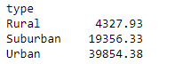

# PyBer_Analysis - Challenge Number 5

## Overview of the PyBer_Analysis
  The purpose of this analysis was to assist a ride sharing app "PyBer" with comparing data on the amount of riders and drivers in three different types of cities, Rural, Urban and Suburban.  By using Python coding in connection with Jupyter notebook and the Pandas library of functions like Matplotlib, we were able to successfully create several summary data frames which provided results that were both easy to read and accurate.  As a result of writing code that performed calculations and create data frames, we were able to provide a final product in the form of a line chart.  The chart provided the most visual summary of the data and compared all three city types by their average weekly fare as calculated between the months of January through April of 2019. 

## PyBer_Analysis Results
  As shown in the summary of the PyBer data frame below, there is a significant difference between the overall data when broken down by each city type.   Most significantly it can be noted that the Urban and Suburban cities provide more rides to citizens in those particular areas than those of the Rural type.  Specifically, the Rural areas provided only 125 rides while the Suburban and Urban cities provided over 500 to 1,500 more at 625 and 1,625 respectively.  

 

***
* Results Based on Rides by City Type
  As previously stated, not only the ride counts are significantly different between city types, but of course the fares are much different as well.  Once again the total fares by city type differed greatly in the Rural areas than in the Suburban and Urban areas with the greatest discrepancy being between the Rural average fare at only $4,327.93 compared to the Urban average fare at $39,854.38 as detailed in the screenshot of the total_fares_by_city_type data frame below. 
  

This discrepancy is also shown in our final chart produced by the data as you can see the Rural line in blue hovering close to the lower limit of the average fare and well below $500, while the Suburban and Urban city types exceeed the $500 mark. 

* Results Based on Drivers by City Type

***

## Summary 
